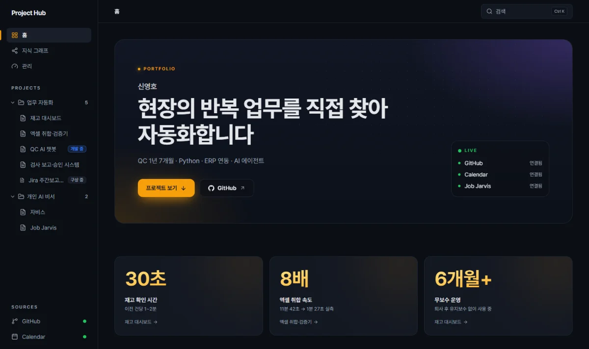
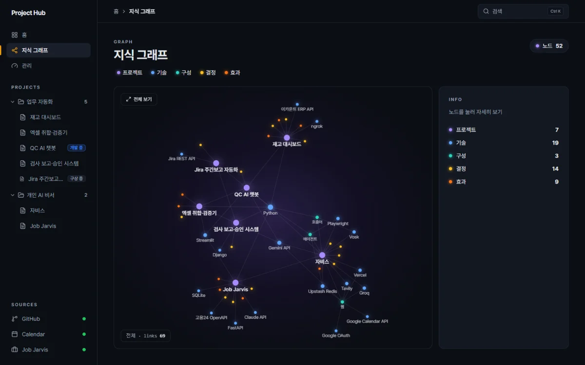
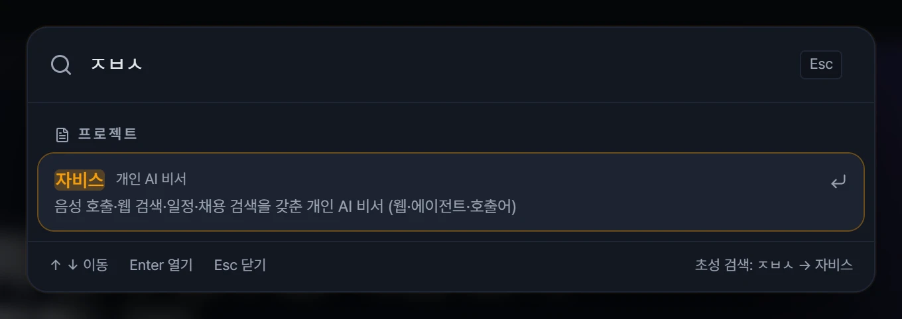
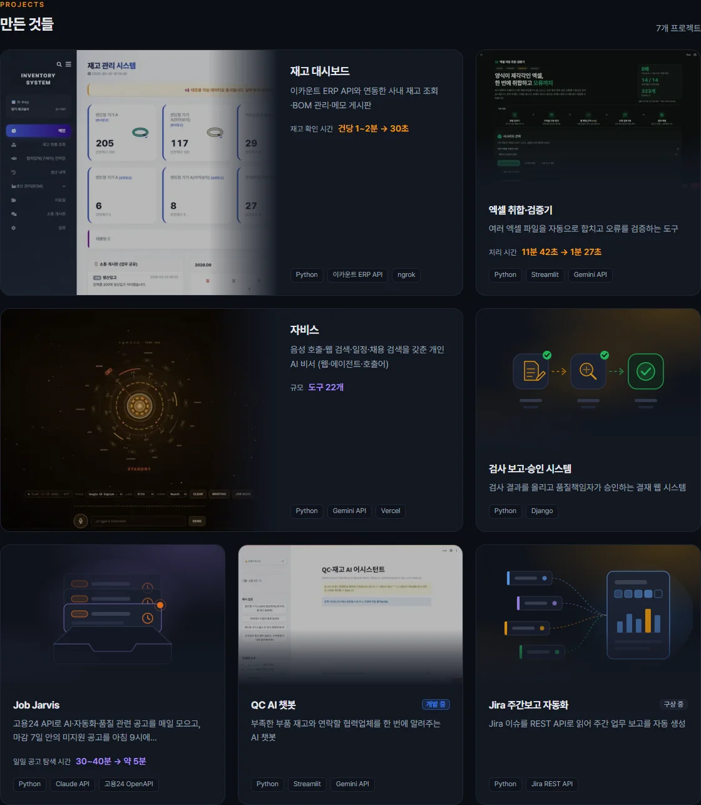
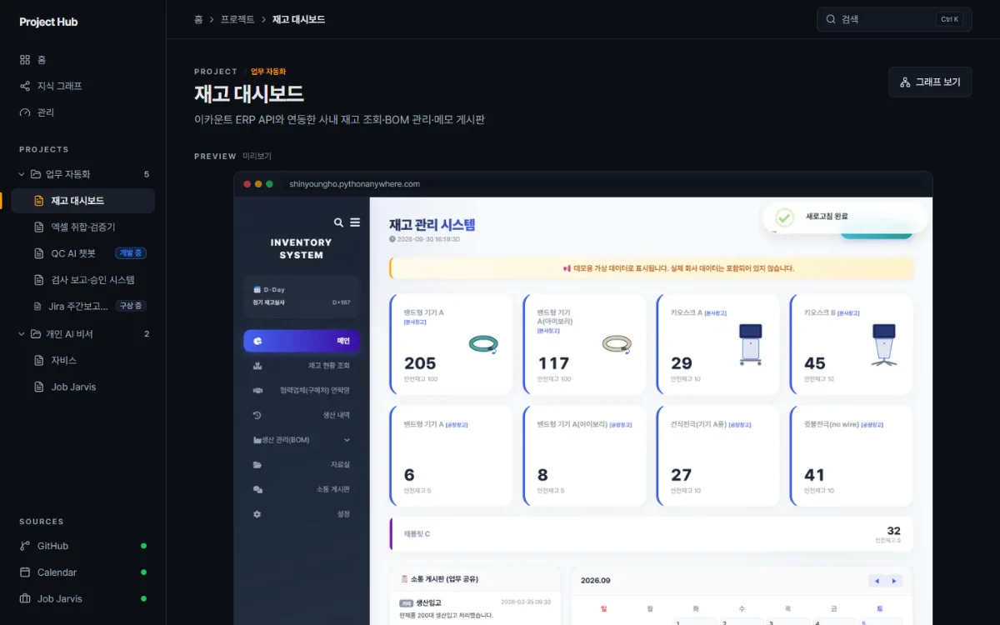
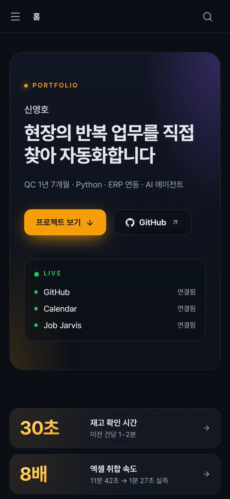
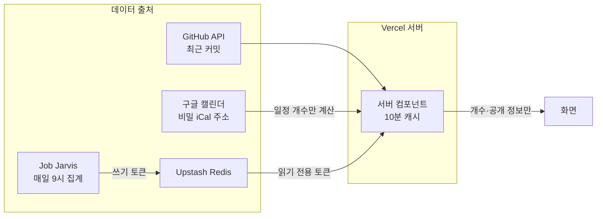
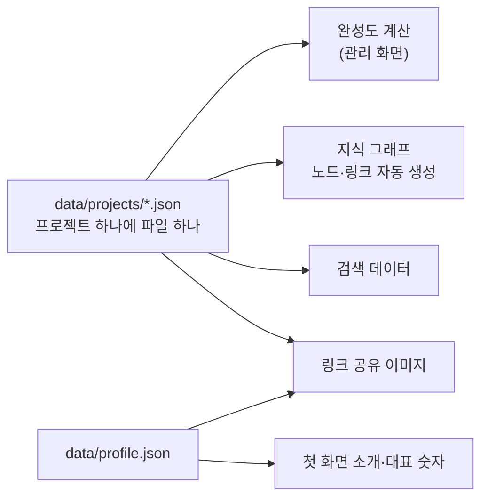

# Project Hub

현장의 반복 업무를 직접 찾아 자동화한 프로젝트들을 한곳에서 관리하고 보여주는 포트폴리오

사이트: https://project-hub-youngho.vercel.app



## 왜 만들었나

QC 현장에서 시작한 자동화 프로젝트가 늘어나면서 저장소, 배포 플랫폼(Vercel, PythonAnywhere, Streamlit 등), 계정이 프로젝트마다 흩어졌습니다. 지금 무엇이 돌아가고 있는지 확인하려면 여러 곳을 열어야 했고, "왜 이렇게 만들었는지"는 기억에만 남아 있었습니다.

그래서 프로젝트 정보를 한 형식(JSON)으로 모으고, 실제 운영 데이터까지 붙인 관리 도구를 만들었습니다. 같은 화면을 그대로 공개하면 면접관이나 방문자가 프로젝트의 문제, 결정, 효과를 한 번에 볼 수 있어서 포트폴리오로도 씁니다.

## 주요 기능

### 실시간 운영 현황

GitHub 최근 커밋 시각, 구글 캘린더 일정 개수(오늘 / 이번 주 / 나중에), Job Jarvis가 자동으로 모아 저장한 공고 수를 보여줍니다. 첫 화면 LIVE 패널도 "최근 커밋 3시간 전", "이번 주 일정 4개", "저장 공고 5건"처럼 같은 데이터를 한 줄씩 보여주고, 값을 못 받거나 최근 커밋이 7일보다 오래됐거나 개수가 0이면 "연결됨"만 표시합니다. 공고 수집이 2일 넘게 멈춰 있으면(Job Jarvis는 PC 작업 스케줄러로 돌아감) 마지막 수집 시각 대신 "PC 실행 시 자동 수집"으로 안내합니다. Job Jarvis는 매일 9시에 집계한 개수를 자동으로 올리고, 이 사이트는 서버에서 10분마다 새로 읽습니다.

### 지식 그래프

프로젝트, 기술, 구성, 결정, 효과를 노드로 연결합니다. 같은 기술을 쓴 프로젝트끼리 자연스럽게 묶이고, `/graph?focus=jarvis`처럼 한 프로젝트나 기술 주변만 밝게 보는 포커스 모드가 있습니다. 모바일에서는 그래프를 전체 폭으로 보고, 노드를 누르면 아래에서 정보 창이 올라옵니다.



### Ctrl K 검색

Ctrl+K(맥은 ⌘+K)로 화면, 프로젝트, 기술, 결정을 한 번에 찾습니다. 대소문자와 띄어쓰기를 무시하고, 한글 초성("ㅈㅂㅅ" → 자비스)으로도 찾습니다. 기술을 고르면 지식 그래프에서 그 기술에 포커스하고, 결정을 고르면 해당 프로젝트 화면의 결정 카드로 이동합니다.



### 프로젝트 미리보기와 결정 기록

첫 화면 쇼케이스에는 만든 프로젝트 6개를 보여주고, 구상 중인 프로젝트(Jira 주간보고 자동화)는 그 아래 "다음에 만들 것" 한 줄과 지식 그래프의 점선 노드("구상 중")로만 보여줍니다. 프로젝트 개수(첫 화면, 사이드바, 지식 그래프)에도 구상 중은 넣지 않고 "6 · 구상 1"처럼 옆에 따로 적습니다.

프로젝트마다 실제 화면 캡처, 해결한 문제, 결정(무엇을 / 왜 / 포기한 대안), 측정한 효과(전 → 후)를 정리합니다. 예를 들어 재고 대시보드는 재고 확인 시간이 건당 1~2분에서 30초로 줄었고, 엑셀 취합·검증기는 11분 42초에서 1분 27초로 줄었습니다(실측).





### 링크 공유 카드와 모바일 대응

카카오톡, 링크드인 등에 주소를 붙이면 첫 화면과 프로젝트마다 다른 미리보기 이미지(1200×630)가 나옵니다. 1024px보다 좁은 화면에서는 사이드바가 접히는 메뉴로 바뀌고, 누르는 영역은 44px 이상으로 맞췄습니다.



## 구조





완성도와 그래프는 따로 입력하지 않습니다. JSON 파일을 고치면 관리 화면의 완성도, 지식 그래프, 검색 결과, 공유 이미지가 함께 바뀝니다.

## 공개 사이트에서 개인 정보를 지킨 방법

- **개수만 공개**: 캘린더는 일정 제목, 장소, 참석자를 서버 밖으로 보내지 않고 기간별 개수만 계산합니다. Job Jarvis도 단계별 개수만 올리고, 회사명이나 공고 제목은 Upstash에도 저장하지 않습니다. 공개 화면에는 시스템이 한 일(저장한 공고 수, 수집 시각)만 보여주고, 개인 구직 현황인 지원·서류·면접·결과 개수는 서버에서 읽자마자 버려 HTML과 RSC 데이터에도 나가지 않습니다.
- **비공개 저장소**: GitHub 응답에서 비공개 저장소의 커밋 메시지, 해시, 링크를 서버에서 지우고, 화면에는 자물쇠 표시만 남깁니다.
- **읽기 전용 토큰**: 이 사이트는 Upstash를 읽기만 하므로 읽기 전용 토큰을 씁니다. 실제로 쓰기를 시도해 403으로 막히는지 시험했습니다.
- **이메일**: 저장소에 두지 않고 환경 변수에서 읽습니다. 페이지에는 뒤집은 조각으로만 넘기고, "이메일 복사"를 누를 때 브라우저에서 합칩니다. 그래서 HTML과 RSC 데이터에 주소 문자열이 없습니다.
- **배포 전 검사**: 빌드 결과물(`.next/static`, `.next/server`)에서 토큰, 비밀 주소 같은 문자열이 0건인지 확인한 뒤 올렸습니다.

## 만들면서 발견한 것들

- **읽기 전용인 줄 알았던 토큰이 쓰기도 됐다.** 이름만 믿지 않고 쓰기 시도 시험을 해 보니 값이 실제로 바뀌었습니다. 원래 값으로 되돌린 뒤 토큰을 교체했고, 같은 시험에서 403이 나오는 것을 확인했습니다.
- **주간 리포트가 실제 지원 2건을 47건으로 보고했다.** Job Jarvis의 과거 메일을 같은 집계 공식으로 재현해 원인(상태값 기준 집계)을 확정하고, 실제 지원 기록 기준으로 고쳤습니다.
- **배포 사이트에서만 미리보기가 안 보였다.** 서버가 실행 중에 이미지 파일을 찾는 방식은 배포 환경에서 믿기 어려워서, 캡처할 때 `manifest.json`에 파일 이름과 크기를 기록하고 그 목록을 기준으로 보여주도록 바꿨습니다.

## AI 활용 방식

Claude Code와 함께 개발했습니다. 무엇을 만들지, 어떤 정보를 공개하지 않을지, 무엇을 통과 기준으로 볼지는 직접 정했습니다. 코드는 단계마다 빌드, 화면 좌표 측정(그래프 노드가 영역 안에 있는지, 누르는 영역이 44px인지), 비밀 문자열과 이메일 노출 검사로 확인한 뒤에 반영했습니다.

## 기술 스택

- Next.js 16 (App Router, 서버 컴포넌트), React 19
- Tailwind CSS 4
- react-force-graph-2d, d3-force-3d (지식 그래프)
- ical.js (구글 캘린더 일정 반복 규칙 계산)
- next/og (링크 공유 이미지), Pretendard 글꼴 (OFL)
- Playwright + Microsoft Edge (미리보기 캡처)
- 배포: Vercel / 외부 데이터: GitHub API, Google Calendar iCal, Upstash Redis

## 프로젝트 구조

```
app/                 화면 (첫 화면, 프로젝트, 지식 그래프, 관리), 공유 이미지, 아이콘
components/          사이드바·상단 바, 그래프, 검색 창, 첫 화면 구성 요소, 일러스트
lib/                 데이터 읽기·계산 (프로젝트·완성도, 그래프, GitHub, 캘린더, 공고 수집 현황, 검색, 사이트 정보)
data/projects/       프로젝트 정보 (JSON, 프로젝트 하나에 파일 하나)
data/profile.json    첫 화면 소개 문구와 대표 숫자
public/previews/     프로젝트 화면 캡처와 manifest.json
assets/fonts/        공유 이미지용 Pretendard 부분 글꼴과 라이선스
scripts/             미리보기 캡처 스크립트
docs/screenshots/    이 README 의 스크린샷
```

## 데이터 구조

**`data/projects/<id>.json`**

| 필드 | 설명 |
|---|---|
| `id`, `name`, `order`, `group` | 주소에 쓰는 id, 이름, 표시 순서, 그룹(업무 자동화 / 개인 AI 비서) |
| `summary`, `problem` | 한 줄 요약, 해결한 문제 |
| `status` | 없으면 완성, `"개발 중"` 또는 `"구상 중"`이면 배지를 달고 아직 없는 항목은 완성도 검사에서 뺌 |
| `repo`, `deploy` | GitHub 저장소(`owner/name`), 배포 플랫폼과 주소 |
| `tech`, `parts` | 기술 목록, 구성 요소(이름·저장소·기술) |
| `decisions` | 결정 목록: `what`(무엇을), `why`(왜), `rejected`(포기한 대안) |
| `results` | 효과 목록: `label`, `before`, `after`, `note` |
| `related` | 관련 프로젝트 id |

값을 아직 모르면 `"확인 필요"`라고 적습니다. 화면에 노란 배지로 표시되고 관리 화면의 채워야 할 항목에 잡힙니다.

**`data/profile.json`**: 이름, 한 줄 소개(`tagline`), 보조 문구(`subline`), GitHub 주소, 대표 숫자(`highlights`), 일하는 방식(`stories`). 첫 화면과 링크 공유 카드가 이 파일을 씁니다.

**`public/previews/manifest.json`**: 프로젝트별 캡처 이미지의 `file`, `width`, `height`, `capturedAt`. 직접 캡처한 이미지는 `manual: true`로 표시해 자동 캡처가 덮어쓰지 않게 합니다. 이 목록에 있는 이미지만 화면에 나옵니다.

## 환경 변수

모두 선택 사항입니다. 없으면 그 정보가 들어가는 카드만 "연결 전"으로 표시되고(연결 상태 점은 "미설정"), 나머지 화면은 그대로 동작합니다. 로컬에서는 `.env.local`에, 배포에서는 Vercel 프로젝트 설정에 넣습니다.

| 이름 | 용도 |
|---|---|
| `GITHUB_TOKEN` | GitHub 최근 활동 조회 (서버에서만 사용) |
| `GOOGLE_CALENDAR_ICS_URL` | 구글 캘린더 비밀 iCal 주소, 일정 개수 계산용 |
| `UPSTASH_REDIS_REST_URL` | Job Jarvis 공고 수집 현황이 저장된 Upstash 주소 |
| `UPSTASH_REDIS_REST_READONLY_TOKEN` | 위 데이터를 읽는 읽기 전용 토큰 |
| `CONTACT_EMAIL` | "이메일 복사" 버튼용 주소 (없으면 버튼만 숨김) |

## 로컬 실행

```bash
npm install
npm run dev
```

브라우저에서 http://localhost:3000 을 엽니다. 배포와 같은 조건으로 보려면 `npm run build` 후 `npm start`를 씁니다.

## 미리보기 캡처

```bash
npm run capture
```

`deploy.url`이 있는 프로젝트의 첫 화면을 PC에 설치된 Microsoft Edge로 찍어 `public/previews/`에 저장하고, `manifest.json`에 파일 이름, 크기, 날짜를 기록합니다. 로그인이나 값 입력은 하지 않습니다.

- `npm run capture -- jarvis`: 특정 프로젝트만 (여러 개 가능)
- `npm run capture -- jarvis --force`: 직접 캡처한 이미지(`manual: true`)도 다시 찍기
